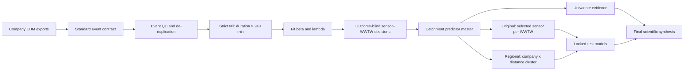

# CSO Spatial Drivers

## A reproducible and teachable workflow from spill events to catchment-scale evidence

[](https://github.com/zainahmed7771/Individual-CSO-sensor-Analysis/actions/workflows/tests.yml)
[](https://www.python.org/)
[](LICENSE)

**Research question:** can measurable environmental and operational characteristics of wastewater catchments explain and predict differences in combined sewer overflow (CSO) behaviour?

This repository is the maintained public release of a UCL research internship. It is organised so that a new student can first understand the science, then run a small complete example, and finally reproduce the authorised analysis after supplying the documented source data.

The repository deliberately separates three claims:

1. **The teaching demonstration is fully executable from the clone.** It uses synthetic data and exercises cleaning, strict long-tail fitting, accepted sensor–WWTW linkage, predictor joining, univariate analysis, locked-test modelling and provenance reporting.
2. **The scientific core is configuration-driven.** The same runner accepts authorised standardised events, accepted assignments, monitoring exposure and the predictor master without editing Python source code.
3. **Raw-data reconstruction is conditional on source access.** Company exports, large rainfall archives and spatial datasets are not redistributed here. Their acquisition, preparation, licences and manual-QC steps are documented without pretending that unavailable data can be recreated.

## Start here

Run these commands from the **repository root**—the directory containing `pyproject.toml`.

### Windows PowerShell

```powershell
git clone https://github.com/zainahmed7771/Individual-CSO-sensor-Analysis.git
cd Individual-CSO-sensor-Analysis

py -3.12 -m venv .venv
.\.venv\Scripts\Activate.ps1
python -m pip install --upgrade pip
python -m pip install -e ".[test]"

python scripts\check_inputs.py --config config\demo.yaml
python scripts\run_pipeline.py --config config\demo.yaml
pytest -q
```

### macOS or Linux

```bash
git clone https://github.com/zainahmed7771/Individual-CSO-sensor-Analysis.git
cd Individual-CSO-sensor-Analysis

python3 -m venv .venv
source .venv/bin/activate
python -m pip install --upgrade pip
python -m pip install -e '.[test]'

python scripts/check_inputs.py --config config/demo.yaml
python scripts/run_pipeline.py --config config/demo.yaml
pytest -q
```

The complete demonstration writes to `outputs/demo_pipeline/`. Its final files are:

- `03_master/scientific_master.csv` – one teaching row per accepted WWTW;
- `04_univariate/univariate_results.csv` – outcome–predictor associations and FDR values;
- `05_machine_learning/model_scorecard.csv` – four locked-test teaching models;
- `05_machine_learning/locked_test_predictions.csv` – untouched-test predictions;
- `06_report/RUN_SUMMARY.md` – human-readable run summary;
- `run_manifest.json` – configuration, input hashes, stage outputs and software context.

Every demonstration result is labelled as synthetic and must not be quoted as a scientific finding.

## Scientific workflow



## Four outcomes

| Outcome | Definition | Interpretation |
|---|---|---|
| `beta` | Shape of the conditional stretched-exponential tail above 240 minutes | Lower beta means a heavier, more persistent fitted tail |
| `lambda` | Inverse-timescale in `S(t)=exp[-(lambda*t)^beta]` | Higher lambda means a shorter characteristic time at fixed beta |
| Mean spill duration | Arithmetic mean of valid event durations | Directly observed duration summary |
| Annualised spill frequency | Valid event count divided by audited monitoring exposure | Exposure-adjusted occurrence rate, not a lifetime count |

The threshold rule is always **strictly greater than 240 minutes**. An event lasting exactly 240 minutes is not in the fitted tail.

## Reproduce the authorised scientific core

Install the spatial/full dependency set if you will also run GIS or historical source stages:

```powershell
python -m pip install -e ".[full,test]"
```

`requirements-lock.txt` records the direct package versions used for the validated Python 3.12 release when a closer environment reconstruction is required.

Copy the scientific configuration and edit only its paths and predictor list:

```powershell
Copy-Item config\scientific.example.yaml config\scientific.yaml
python scripts\check_inputs.py --config config\scientific.yaml
python scripts\run_pipeline.py --config config\scientific.yaml
```

`config/scientific.yaml` is ignored by Git. Paths may point outside the clone, allowing controlled or large data to remain in their approved storage location.

The four required scientific-core inputs are:

| Input | Required identity | Purpose |
|---|---|---|
| Standardised events | `company + permit_number + start_time + stop_time` | Event cleaning and fitted/observed outcomes |
| Accepted assignments | unique `sensor_uid`, plus `company`, `uwwCode`, `assignment_evidence` | Freezes outcome-blind WWTW linkage |
| Monitoring exposure | unique `sensor_uid`, positive `monitoring_years` | Annualised spill frequency |
| Predictor master | unique `company + uwwCode` | External environmental and operational predictors |

The runner refuses missing assignments, blank assignment evidence, duplicate keys, invalid exposure, a changed 240-minute rule, or configured leakage variables. It does not invent missing monitoring years or sensor–WWTW relationships.

The maintained runner provides a transparent Ridge baseline for all four outcomes and is the recommended teaching and integration test. The exact historical submitted models and the later regional-cluster experiment remain under `07_machine_learning/`, with their frozen scorecards and reports under `outputs/headline_*` and `docs/`. A new scientific release should state explicitly whether it reproduces a frozen historical analysis or trains the maintained baseline; the two are not interchangeable.

For raw provider exports and environmental GIS reconstruction, follow [`docs/FULL_PIPELINE_RUNBOOK.md`](docs/FULL_PIPELINE_RUNBOOK.md). That guide records the exact working directory, inputs, scripts, outputs, validation gates and hand-off between stages.

## Repository map

| Location | What a student should use it for |
|---|---|
| `QUICKSTART.md` | First successful run in approximately ten minutes |
| `docs/STUDENT_LEARNING_PATH.md` | Guided explanation of the code and scientific reasoning |
| `docs/FULL_PIPELINE_RUNBOOK.md` | Authoritative command-by-command reproduction guide |
| `config/demo.yaml` | Complete included teaching configuration |
| `config/scientific.example.yaml` | Template for authorised scientific inputs |
| `src/cso_spatial_drivers/` | Portable tested implementation |
| `scripts/run_pipeline.py` | One entry point for the executable core |
| `01_`–`05_` | Acquisition, provider harmonisation, fitting, linkage and predictors |
| `06_`–`08_` | Statistical analysis, machine learning and synthesis |
| `09_experimental_extensions/` | Later diagnostics, clearly separated from the primary workflow |
| `tests/` | Scientific invariants, leakage checks and full demonstration test |
| `outputs/headline_*` | Small authoritative result summaries and figures |
| `docs/Full-report.pdf` | Full project report |

## Original and regional modelling approaches

The original submitted design selects one sensor per WWTW using beta-blind linkage evidence. The later regional experiment groups WWTWs inside company boundaries to test whether one selected overflow is a noisy proxy for wider system behaviour. They answer different questions and are retained separately.

| Outcome | Original RMSE gain | Original R² | Regional RMSE gain | Regional R² |
|---|---:|---:|---:|---:|
| Beta | 4.85% | 0.073 | 17.39% | 0.314 |
| Lambda | 4.94% | 0.095 | 9.72% | 0.180 |
| Mean duration | 2.64% | 0.052 | 7.78% | 0.143 |
| Annualised frequency | 6.99% | 0.133 | -1.99% | -0.063 |

Positive gain means lower RMSE than that target's own mean-only Dummy model. Raw RMSE is not compared between differently transformed targets. The regional beta result is promising, but bootstrap uncertainty includes no improvement; it is not presented as definitive.

## Reproducibility safeguards

Automated checks protect the definitions most likely to be broken during reuse:

- event chronology, duration calculation and de-duplication;
- strict `duration_minutes > 240` tail membership;
- positive bounded beta/lambda estimates;
- explicit same-company/outcome-blind assignment contracts;
- row- and order-preserving predictor joins;
- forbidden ML predictor families and locked-test separation;
- recomputation of stored scorecard metrics;
- end-to-end creation of every teaching output;
- documentation links, secrets, machine paths and oversized/raw GIS files.

GitHub Actions runs the supported tests and complete teaching pipeline after pushes and pull requests.

## Data availability and provenance

Raw company EDM records, correspondence, large NIMROD archives and external spatial datasets are intentionally excluded. This prevents accidental redistribution and keeps the clone usable. Their omission does not make absence a successful full scientific run: `check_inputs.py` fails with the exact missing paths.

See [`DATA_AVAILABILITY.md`](DATA_AVAILABILITY.md), [`docs/DATA_PROVENANCE.md`](docs/DATA_PROVENANCE.md), [`docs/DATA_ACQUISITION_CHECKLIST.md`](docs/DATA_ACQUISITION_CHECKLIST.md), and [`Sewer EIR Coverage Tracker (Visual).xlsx`](Sewer%20EIR%20Coverage%20Tracker%20%28Visual%29.xlsx).

Third-party datasets retain their providers' terms; the repository licence does not relicense external data.

## Interpretation limits

Catchment polygons are contextual proxies, not proven sewer-network boundaries. Static predictors do not encode individual storms, operating controls, storage, pumping, maintenance, groundwater state or antecedent saturation. Associations are not causal effects, and predictive improvement does not establish mechanism.

## Citation and licence

Citation metadata are provided in [`CITATION.cff`](CITATION.cff). Repository-authored software and documentation are released under the [`MIT License`](LICENSE). External datasets and third-party materials remain subject to their original licences and are not included unless explicitly identified.

**Author:** Zain Ahmed, UCL research internship, 2026.
