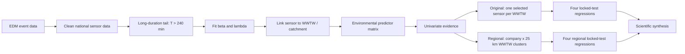

# CSO Spatial Drivers

## From national spill records to catchment-scale prediction

**Research question:** Can environmental and operational characteristics of wastewater catchments explain and predict differences in combined sewer overflow (CSO) spill behaviour?

This repository is the public, reproducible release of a UCL research internship. It follows water-company event-duration monitoring records from event cleaning through long-duration tail fitting, wastewater-treatment-works (WWTW) linkage, catchment predictor extraction, univariate analysis, and locked-test machine learning. It also contains a later regional-cluster experiment that asks whether one selected sensor was too noisy a proxy for a wider wastewater system.

## Why this project matters

Combined sewer systems carry wastewater and rainfall runoff in the same network. During wet weather, hydraulic capacity can be exceeded and diluted sewage may discharge through a monitored overflow. These events are shaped by rainfall and catchment context, but also by sewer topology, storage, pumping, control logic, treatment headroom, groundwater and antecedent wetness. Many of those hydraulic and time-varying states are not present in national open datasets.

The project therefore asks a deliberately limited question: how much information about differences between sites is contained in the external catchment and operational variables that can be assembled consistently across England? Association is not causality, and prediction is not explanation.

## Scientific workflow



## Four outcomes

| Outcome | Definition | Interpretation |
|---|---|---|
| beta | Shape parameter of the conditional stretched-exponential tail above 240 minutes | Lower beta indicates a heavier, more persistent long-duration tail |
| lambda | Inverse-timescale parameter in `S(t)=exp[-(lambda*t)^beta]` | Higher lambda implies a shorter characteristic time at fixed beta |
| Mean spill duration | Arithmetic mean of valid event durations | Directly observed duration summary |
| Annualised spill frequency | Valid events divided by valid monitoring years | Exposure-adjusted occurrence rate, not raw lifetime count |

## Dataset scale

The final selected-sensor scientific master contains **1,231 unique WWTWs**. Separate target-quality rules yield **819 beta**, **783 lambda**, **1,228 duration**, and **967 annualised-frequency** modelling rows. Upstream spatial matching began from **25,409 unique sensors**, of which **8,960** had finite beta estimates and **692** passed the strict beta-quality definition used for the earlier inferential work. The regional extension maps **1,444 WWTWs** to **259 independent 25 km within-company regions** and verifies exact duration summaries from **2,045,832 cleaned, de-duplicated assigned events**.

These are different cohorts because quality and exposure requirements differ by target. The code does not force one complete-case cohort across all outcomes.

## Main methods

1. **Acquisition and harmonisation.** Company EDM exports arrived in different schemas and year coverage. The public release supplies schemas, acquisition notes and a synthetic demo, not the raw company records.
2. **Event QC.** Permit identifiers are normalized; timestamps are parsed; duration is calculated in minutes; invalid end-before-start records and duplicate events are rejected.
3. **Tail fitting.** The active tail is strictly `duration_minutes > 240`. Conditional maximum likelihood fits `S(t)=exp[-(lambda*t)^beta]` with beta constrained to `[0.01, 2]`; nonparametric sensor-event bootstrap intervals support quality screening.
4. **Spatial linkage.** Sensors are assigned within company using validated polygon containment and documented name/distance evidence. Matching is beta-blind and does not claim hydraulic connectivity.
5. **Catchment predictors.** Hydrogeology, static rainfall, annual NIMROD indices, land cover, population density, building age, terrain slope, treatment-capacity ratio and catchment area are joined using audited keys and EPSG:27700 area calculations.
6. **Univariate analysis.** Log-outcome models use HC3 robust uncertainty, Pearson/Spearman summaries and false-discovery-rate correction. Reported percentage changes are associations.
7. **Original predictive ML.** Four separate 70/15/15 train/validation/locked-test regressions compare Dummy, OLS, Ridge and Elastic Net. Preprocessing is fitted inside training folds; RMSE is the headline metric.
8. **Regional comparison.** WWTWs are grouped within company by target-independent 25 km complete linkage, with 10 and 50 km sensitivities. Predictors are aggregated using scientific weights; frequency uses pooled monitoring exposure.

## Main findings

### One-variable evidence

The univariate stage found multiple FDR-supported associations, but the pattern was outcome-specific rather than a single universal driver. Beta tended to be higher in more urban, densely populated and larger catchments and lower with wetter-winter climatology; low-productivity hydrogeology showed the opposite beta direction. Lambda often moved in the opposite direction to beta, which is consistent with the two parameters being jointly fitted and is one reason lambda must be described as an inverse-timescale rather than a duration. Mean duration showed evidence involving suburban land cover, winter/heavy rainfall, treatment-capacity ratio and dry-spell indices. Annualised frequency had fewer supported variables, with hydrogeological flow/productivity composition and catchment area among the clearest signals. These models are unadjusted, their percentage effects use predefined meaningful predictor changes, and composition variables are correlated. They show where consistent associations exist; they do not identify causal mechanisms or guarantee multivariable predictive importance.

### Why retain both predictive approaches?

The selected-sensor/WWTW models preserve the original submitted design and provide the most direct link to a named treatment catchment. The regional models answer a later, different question: whether neighbouring WWTWs inside one company form a more stable unit for broad system behaviour. Reporting only the regional analysis would erase that change of estimand; reporting only the original analysis would omit the strongest beta result. The release therefore keeps separate scripts, configurations, models, predictions, figures and reports for both pathways, then compares them only through target-normalized metrics.

### Original selected-sensor / one-WWTW approach

All four original models beat their own locked-test Dummy baseline, but only modestly. RMSE improvements were **4.9% for beta**, **4.9% for lambda**, **2.6% for duration**, and **7.0% for annualised frequency**. Test R-squared ranged from **0.052 to 0.133**. Frequency was the strongest original target; lambda was unstable because the fitted scale spans many orders of magnitude. Population density, hydrogeology, rainfall and catchment scale appeared repeatedly, but no predictor made the models accurate.

### Regional-cluster approach

The regional experiment improved **beta most strongly: 17.4% RMSE gain with R-squared 0.314**. Lambda improved **9.7%** and pooled duration **7.8%**. Regional frequency did **not** improve: **-2.0%**, R-squared **-0.063**. Bootstrap intervals for the three positive regional gains crossed zero, so the result is promising rather than definitive.

The correct comparison is not “regional is always better.” Regional aggregation helped beta and, to a lesser extent, lambda and duration, but it also reduced target variance and smoothed extremes. Ten-kilometre sensitivities sometimes performed better, while 50 km often lost sample size and signal. The full mixed-effects benchmark was singular and is reported as an honest negative result.

### Scientific synthesis

Measured catchment context contains real but modest information. The new regional result suggests that the original one-sensor unit contributed noise, especially for beta. It does not remove the larger information gap: sewer topology, pipe and storage capacity, pumping and control state, event rainfall, antecedent saturation, groundwater and maintenance remain unmeasured. More complex algorithms are not the first priority.

## Repository map

| Folder | Purpose |
|---|---|
| `01_data_acquisition/` | Provider coverage, source schemas and safe acquisition scripts |
| `02_data_cleaning/` | Common event contract, duration QC and sensor identity |
| `03_tail_parameter_fitting/` | Strict 240-minute tail, beta/lambda MLE and bootstrap |
| `04_spatial_linkage/` | Sensor-to-WWTW/catchment matching rules and audits |
| `05_environmental_predictors/` | External predictor extraction and dictionary |
| `06_univariate_analysis/` | One-variable inference and cross-outcome tables |
| `07_machine_learning/` | Original selected-sensor and regional-cluster ML tracks |
| `08_final_synthesis/` | Headline scorecards, figures and final conclusions |
| `09_experimental_extensions/` | Univariate predictive screening and hierarchical benchmark |
| `src/` | Small portable package used by the synthetic demo |
| `tests/` | Scientific invariants and leakage checks |
| `docs/` | Reports, methods, provenance and repository walkthrough |

## Reproduce the project

```bash
python -m venv .venv
# Windows: .venv\Scripts\activate
# macOS/Linux: source .venv/bin/activate
python -m pip install -e .[test]
pytest -q
python scripts/run_reproducible_demo.py
```

The demo is synthetic and finishes quickly. Full reproduction requires the omitted raw/licensed sources described in `DATA_AVAILABILITY.md` and a local `config/paths.yaml` based on `config/paths.example.yaml`. QGIS is optional for cartographic inspection and is not required for the demo.

The public test suite protects the scientific invariants that are easiest to break during reuse: duration arithmetic and chronology, the strict `>240` threshold, positive bounded tail parameters, same-company spatial assignment, row-preserving predictor joins, absence of target leakage, non-overlapping split groups and recomputation of saved locked-test RMSE. The authoritative raw-data workflow remains necessarily conditional on access rights; the synthetic demo verifies implementation behaviour without pretending to recreate the scientific sample.

## Three levels of navigation

- **Five minutes:** this README, `outputs/headline_tables/`, and `outputs/headline_figures/`.
- **Thirty minutes:** `docs/final_report.pdf`, both ML reports, and `docs/GITHUB_REPOSITORY_WALKTHROUGH.pdf`.
- **Technical audit:** stage READMEs, scripts, configs, tests, provenance tables and saved predictions.

## Data availability

Raw company EDM records, large NIMROD archives, licensed spatial products, correspondence and machine-local configuration are intentionally excluded. Small synthetic examples, schemas, authoritative headline tables, model metrics and final figures are included. See `DATA_AVAILABILITY.md` and `docs/DATA_PROVENANCE.md`.

For a consolidated guide to the underlying data sources, see `Sewer EIR Coverage Tracker (Visual).xlsx`. The workbook identifies the datasets used across the project and points to where the relevant data can be accessed or downloaded from their original sources.

## Limitations

Catchment boundaries are proxies for sewer systems; annual/static predictors do not encode individual storms; monitoring and operating practices differ by company; beta and lambda are jointly fitted; regional averaging can create apparent predictability by shrinking extremes. Results are predictive/associational and should not be interpreted causally.

## Citation

Use `CITATION.cff`. No DOI or software licence is asserted. `LICENSE_DECISION_REQUIRED.md` must be resolved before making a public repository.

## Author and research setting

Zain Ahmed, UCL research internship, 2026.
